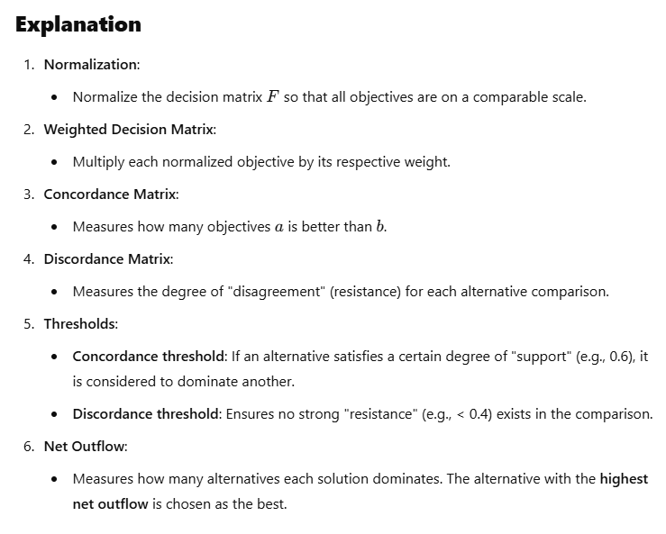

### 1. Phương pháp trọng số (Weighted Sum Model - WSM)
Ý tưởng: Chuyển các mục tiêu khác nhau thành một mục tiêu tổng hợp thông qua việc gán trọng số cho từng mục tiêu.
Công thức:


+ Ưu điểm: Đơn giản, dễ hiểu và triển khai.
+ Hạn chế: Không hiệu quả khi các tiêu chí có đơn vị đo lường khác nhau hoặc khi các mục tiêu không tuyến tính.


### 2. Phương pháp phân tích thứ bậc (Analytic Hierarchy Process - AHP)
Ý tưởng: Xây dựng cấu trúc phân cấp cho vấn đề, so sánh cặp đôi giữa các tiêu chí để xác định trọng số của từng tiêu chí.

```code
Bước thực hiện:
+ Xác định các tiêu chí và mục tiêu.
+ So sánh cặp đôi để tạo ma trận so sánh.
+ Tính toán trọng số ưu tiên của các tiêu chí thông qua ma trận này.
```

+ Ứng dụng: Phù hợp khi các tiêu chí không thể định lượng rõ ràng.
+ Hạn chế: Phụ thuộc vào đánh giá chủ quan của người ra quyết định.


### 3. Phân tích thứ tự ưu tiên (TOPSIS - Technique for Order Preference by Similarity to Ideal Solution)
Ý tưởng: Giải pháp tốt nhất là giải pháp có khoảng cách gần nhất với nghiệm lý tưởng dương (ideal solution) và xa nhất với nghiệm lý tưởng âm (negative ideal solution).

```code
Các bước chính:
+ Chuẩn hóa ma trận quyết định.
+ Xây dựng nghiệm lý tưởng dương và lý tưởng âm.
+ Tính khoảng cách Euclidean đến các nghiệm lý tưởng.
+ Xếp hạng các giải pháp theo độ tương đồng.
```

+ Ưu điểm: Hiệu quả và trực quan.
+ Hạn chế: Nhạy cảm với các trọng số và đơn vị đo lường.

### 4. Phương pháp PROMETHEE (Preference Ranking Organization Method for Enrichment Evaluations)
Ý tưởng: So sánh các giải pháp theo cặp, đánh giá mức độ ưu tiên dựa trên hàm ưu tiên.

```code
Các bước:
+ Tính toán các chỉ số ưu tiên cho từng cặp giải pháp.
+ Tổng hợp thành chỉ số ưu tiên toàn cục.
+ Xếp hạng các giải pháp dựa trên chỉ số này.
```

```code
Steps in PROMETHEE
+ Preference Function: Define a preference function P(a,b) for each objective that compares two alternatives a and b.
+ Preference Degree: Calculate pairwise preference values for all alternatives and objectives.
+ Aggregated Preference Index: Combine preferences across all objectives using predefined weights.
+ Net Flow Calculation: Compute the positive flow (leaving flow), negative flow (entering flow), and net flow for each alternative.
+ Ranking: Rank the solutions based on their net flow.
```


+ Ứng dụng: Phù hợp với bài toán có nhiều tiêu chí định lượng và định tính.


### 5. Phương pháp ELECTRE (Elimination and Choice Expressing Reality)
Ý tưởng: So sánh cặp đôi giữa các giải pháp dựa trên tiêu chí vượt trội và không bị thống trị.

```code
Các bước:
+ Xác định ma trận đánh giá cho từng tiêu chí.
+ Xác định chỉ số đồng thuận và không đồng thuận.
+ Loại bỏ các giải pháp không tốt dựa trên ngưỡng chấp nhận.
```




+ Ưu điểm: Xử lý tốt các bài toán có tiêu chí xung đột.
+ Hạn chế: Phức tạp khi số lượng giải pháp và tiêu chí lớn.


### 6. Phương pháp VIKOR (VlseKriterijumska Optimizacija I Kompromisno Resenje)
Ý tưởng: Xác định nghiệm gần với giải pháp lý tưởng thông qua chiến lược thỏa hiệp.


+ Ứng dụng: Giải quyết các vấn đề mà người ra quyết định có xu hướng tìm kiếm giải pháp thỏa hiệp tốt nhất.


### 7. Phương pháp MOORA (Multi-Objective Optimization on the Basis of Ratio Analysis)
Ý tưởng:  Phân tích tỷ lệ giữa các mục tiêu để xếp hạng các giải pháp.


### 8. Phương pháp Gray Relational Analysis (GRA)
Ý tưởng:  Gray Relational Analysis (GRA) method is a robust and intuitive approach for ranking alternatives in multi-criteria decision-making. 
By normalizing the data and calculating relational coefficients, it effectively identifies the solutions that are closest to the ideal solution. 


### 9. Phương pháp Goal Programming (GP)
Ý tưởng:  Goal Programming (GP) is a method in multi-criteria decision-making (MCDM) used to minimize deviations from 
predefined goals for each objective. It is particularly useful when decision-makers have specific target values for each objective.


